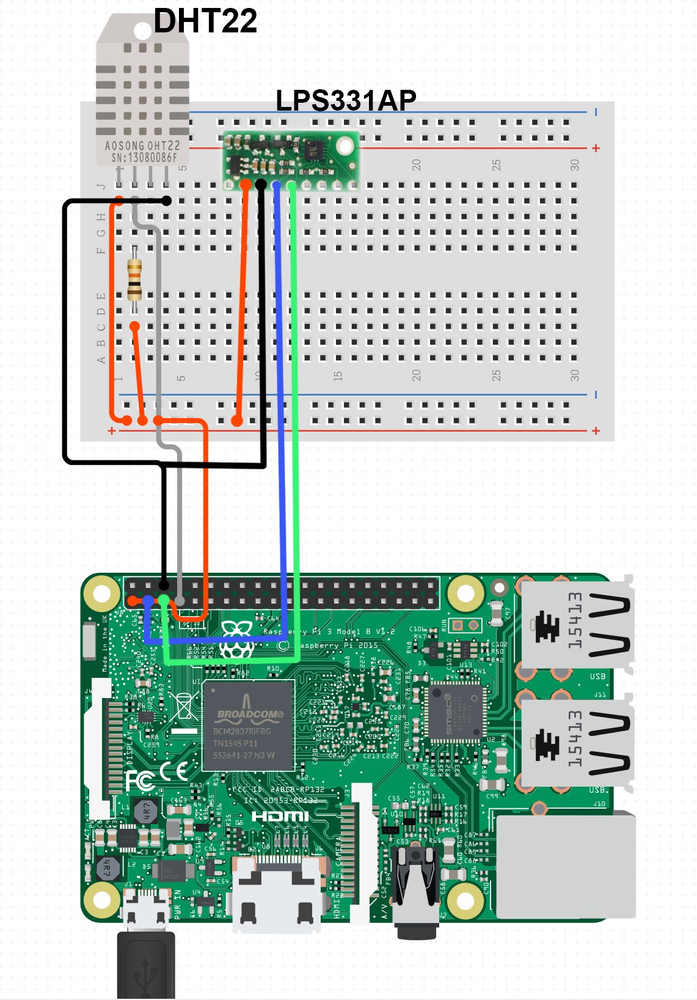

# Raspberry Pi + DHT22 + LPS331AP
Simple station for monitoring basic weather conditions
Live demo - https://rkarwacki.github.io/sensors/

### Data collection
`data-collection/read-sensors.py` is the main script that reads the output from the sensors. 
Can be added to crontab or used in other ways.

Data format is CSV

`date,temperature_dht,temperature_lps,humidity,pressure`

Both DHT and LPS sensors can read temperature so both are logged - this can be then averaged.

### Data correction

Due to events like power outages, there are gaps in the data. 
It sometimes happens that data is written to the file with garbage like `NULL` characters, and sometimes, 
for some reason, entries are not written to the file chronologically. Therefore, when working with huge amounts of data,
the data must be checked for errors before further processing. 
All scripts in `data-correction` directory have comments indicating their purpose. 

### Wiring

